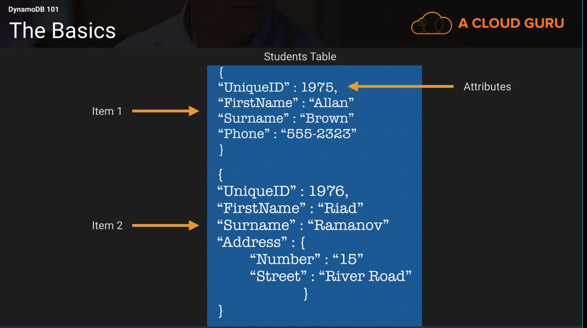

# DynamoDB 101

Amazon DynamoDB is a fast and flexible NoSQL database service for all applications that need 
consistent, single-digit millisecond latency at any scale. 
It is fully managed database and supports both document and key-value data modules.
Its flexible data model and reliable performance make it a great fir for mobile,
web, gaming, ad-tech, IoT, and many other applications.

#### Quick Facts 
* Stored in SSD Drives 
* Spread across 3 geographically distinct data centers
* Eventual Consistent Reads (Default)
    * Consistency across all copies of data usually reached within a second. Repeating a read 
    after a short time should return the updated data. (Best Read Performance)
* Strongly Consistent Reads 
    * A strongly consistent read returns a result that reflects all writes that received a successful response prior to the read.

#### The Basics 
* Tables 
* Items (Think of rows of data in table)
* Attributes (Think of a column of data in table)

#### Pricing 
* Provisioned Throughout Capacity 
    * Write Throughout $0.0065 per hour for every 10 units 
    * Read Throughout $0.0065 per hour for every 50 units
* First 25gb is stored per month is free
* Storage costs 0f $.25gb per month there after

##### Example of Cost 
Our application performs 1 million reads and 1 million writes per day, while storing 28 gb of data.
How many writes per:
###### So 1,000,000 (writes) / 24 (hours) / 60 (minutes) / 60 (seconds) = 11.6 writes per second

A DynamoDB Write Capacity Unit can handle 1 write per second, so you need 12 Write Capacity 
Units. For Write throughput, you are charged on $0.0065 for every ten units.

##### So ($0.0065/10) * 12 * 24 = $0.1872 per day 

To handle 1 million strongly consistent reads per day, you need 12 Reads Capacity Units. For read 
throughput you are charged $0.0065 for every 50 units.

##### S0 ($0.0065/50) * 12 * 24 = $0.0374 per day

Storage costs is $25 per GB per month. 
Lets assume our is 28GB. 
We get the first 25 for free, so we only pay for 3GB of storage which is $0.75 per month 

Total Cost = (30 * (0.1872 + 0.0374)) + .75 = $7.488

With free tier you get 

25 Read Capacity Units and 25 Write Capacity Units for free

