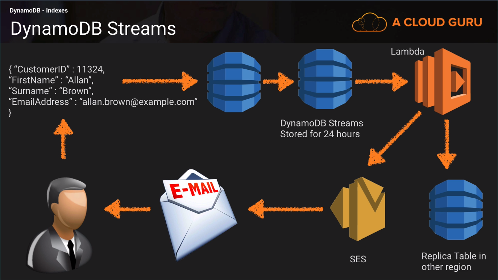

# DynamoDB Indexes 

### Primary Keys 
#### Two Types of Primary Keys Available;

#### Single Attribute (Think unique ID)
* Partition key (Hash Keys) composed of one attribute 

#### Composite (Think unique ID and data range)
* Partition key & Sort key (Hash & Range) composed of two attributes

#### Partition Key 
* DynamoDB uses the partition key's value as the input to an internal hash function.
The output from the hash function determines the partition (This is simply the physical location in which the data is stored).
* No two items in a table can have the same partition key value!!

#### Partition key and Sort key (Hash & Range)
* DynamoDB uses the partition key's value as the input to an internal hash function.
The output from the hash function determines the partition (This is simply the physical location in which the data is stored).
* Two items in a table can have the same partition key value, but must have a different Sort key (Range)
* All items with the same partition key are stored together, in sorted order by sort key value.

### Indexes 
#### Local Secondary Index 
* Has the SAME Partition key, different sort key 
* Can OLNY be created when you crete the table. They cannot be removed or modified later.

#### Global Secondary Index
* Has DIFFERENT Partition key and different sort key.
* Can be created at table creation or added later.

## Streams 
* If new item is added to the table, the stream captures the image of the entire item, including all of its attributes
* If an item is updated, the stream captures the "before" and "after" image of any attributes that were modified.
* If an item is deleted from the table, then the stream captures an image of the entire item before it was deleted.

