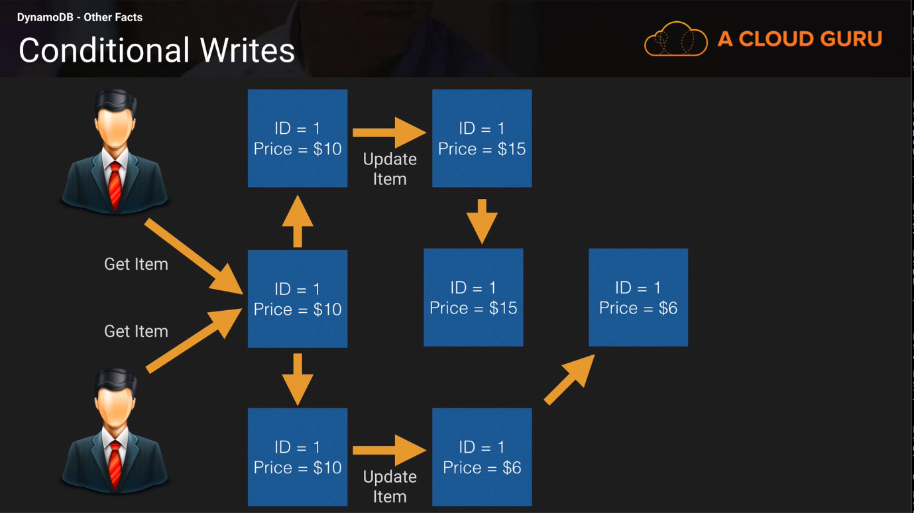
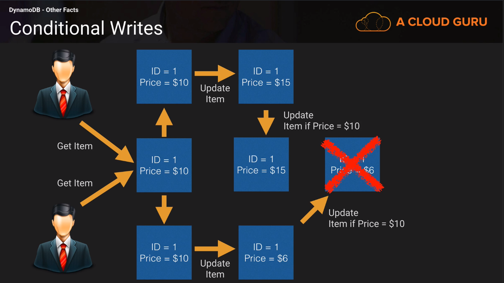

# Other Facts 

#### Conditional Writes 

##### Without Conditions 

##### With Conditions 

##### If item = $10 then update to $12

Note that conditional writes are [idempotent](http://www.restapitutorial.com/lessons/idempotency.html).
This means that you can send the same conditional write request multiple times, but it will have no 
further effect on the item after the first time DynamoDB performs the specified update. 
For Example, suppose you issue a request to update the the price of a book item by 10%, with the expectation that 
the price is currently $20.
However, before you get a response, a network error occurs and you don't know whether you request was
successful or not. Because a conditional update is an idempotent operation, you can send the same request again and 
DynamoDB will update the price only if the current price is $20.

#### Atomic Counters 
DynamoDb supports atomic counters, where you use the UpdateItem operation to increment or 
decrement the value of the existing attribute without interfering with other write requests.
(All write requests are applied in the order they are received). 
For Example, a web application might want to maintain a counter per visitor to their site.
In this case, the application would need to increment this counter regardless of its current value.

#### Batch Operations 
If you application needs to read multiple items, you can use the **BatchGetItem** API.
A single **BatchGetItem** request can retrieve up to 1MB of data, which can contain as many as 100 items.
In addition, a single **batchGetItem** request can retrieve items from multiple tables.

