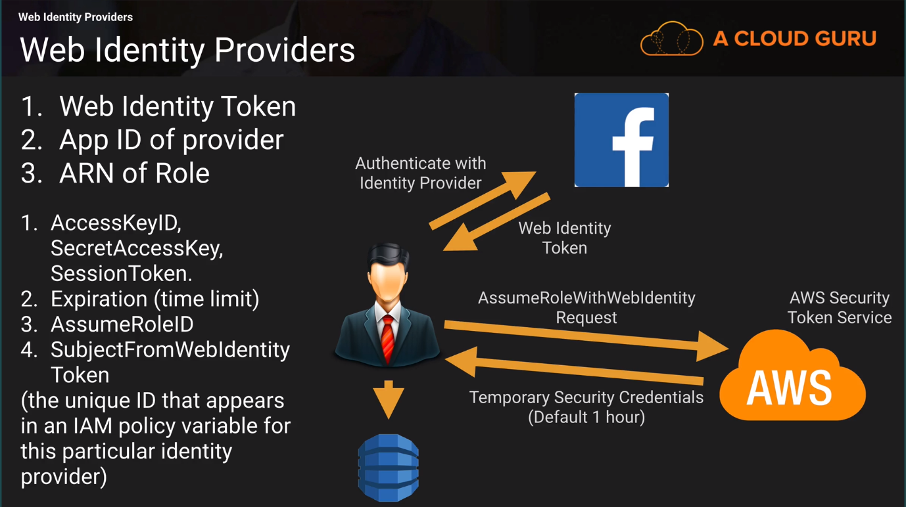

# Web Identity Providers 

You can authenticate users using Web Identity Providers (Such as Facebook, Google, Amazon or 
any other Open_ID Connection-compatible Identity Provider).
This is done using the **AssumeRoleWithWebIdentity** API.

You need to create the role first.

#### Steps to authenticate 
1. User Authenticates with ID provider (such as Facebook).
2. They are passed a Token by the ID provider.
3. You code calls the **AssumeRoleWithWebIdentity** API and provides the providers token 
and specifies the ARN for the IAM Role.
4. App can now access DynamoDB from between 15 minutes to 1 hour (default 1 hour).

